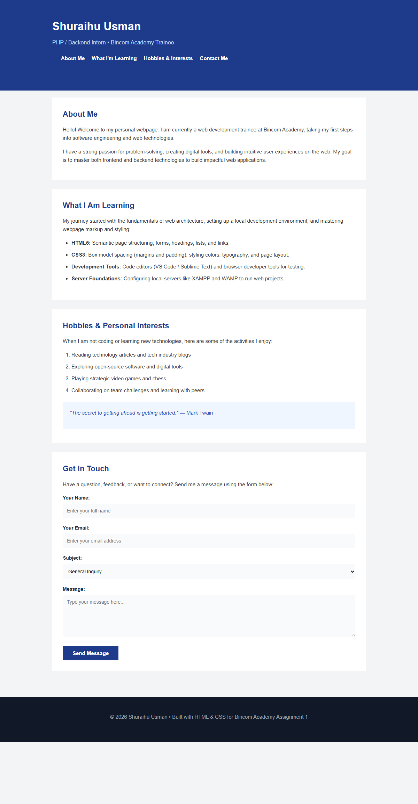

# Bincom Academy - PHP Class Assignment 1

**Organization:** [Bincom-Academy-PHP-Assignments](https://github.com/Bincom-Academy-PHP-Assignments)  
**Repository:** [https://github.com/Bincom-Academy-PHP-Assignments/PHP-Class-Assignment-1](https://github.com/Bincom-Academy-PHP-Assignments/PHP-Class-Assignment-1)  
**Student:** Shuraihu Usman (PHP / Backend Intern & Trainee)  

---

## Lesson 1 Overview: Development Environment Setup & HTML/CSS Overview

### Topics Covered in Lesson 1:
1. **Setup Local Server (XAMPP/WAMP)**
   - Understanding local web server environments (Apache, MySQL, PHP runtime).
   - Web root directories:
     - XAMPP: `C:\xampp\htdocs\`
     - WAMP: `C:\wamp64\www\`
2. **Setup Environment (Text Editor / HTML / CSS)**
   - Configuring code editors (VS Code / Sublime Text / Notepad++).
   - Organizing project directories and standards.
3. **Introduction to HTML and CSS**
   - HTML syntax, semantic tags, headings, paragraphs, lists, forms, and attributes.
   - CSS syntax, selectors, typography, colors, and the **CSS Box Model** (Content, Padding, Margin).
4. **Running the First HTML and CSS Code**
   - Linking external stylesheets (`<link rel="stylesheet" href="style.css">`).
   - Testing web pages in modern web browsers and developer tools.

---

## Assignment Task: Personal Student Profile & Portfolio
Instead of repeating lecture syllabus notes on the page, this assignment applies what was learned in Lesson 1 to build a real **Personal Student Profile & Portfolio** webpage for **Shuraihu Usman**.

### Features & Implementation:
- **Clean HTML Structure (`index.html`):**
  - `<header>` with personal branding and anchor navigation links.
  - `<section>` for About Me with descriptive paragraphs.
  - `<section>` for Learning Journey using an unordered list (`<ul>`).
  - `<section>` for Hobbies & Interests using an ordered list (`<ol>`) and a quote container.
  - `<section>` for Get in Touch featuring an accessible HTML form (name, email, subject dropdown, textarea, and submit button).
  - `<footer>` with copyright and attribution.
- **Simple Flat CSS (`style.css`):**
  - Pure CSS styling with **zero borders** and **zero shadows**.
  - Strict implementation of the **CSS Box Model** through explicit `margin` and `padding` spacing.
  - Flat, readable color scheme and typography.
- **Documentation:**
  - Full Word document report: [Code_Documentation.docx](Code_Documentation.docx)
  - Full Markdown report: [Code_Documentation.md](Code_Documentation.md)
  - Rendered UI Output Screenshot: [ui_output_full.png](ui_output_full.png)

---

## Rendered UI Output

---

## How to Run This Project
1. **Direct in Browser:** Double-click `index.html` or open via any browser.
2. **Via Local Server (XAMPP / WAMP):** Copy this folder to `C:\xampp\htdocs\` and visit `http://localhost/PHP-Class-Assignment-1/index.html`.
